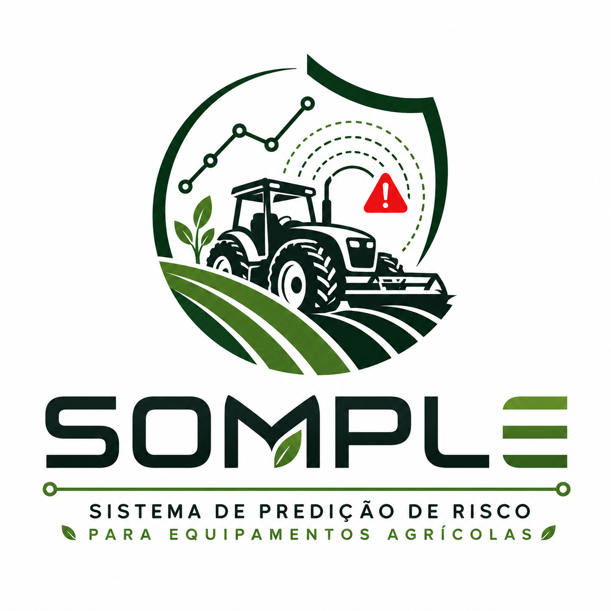
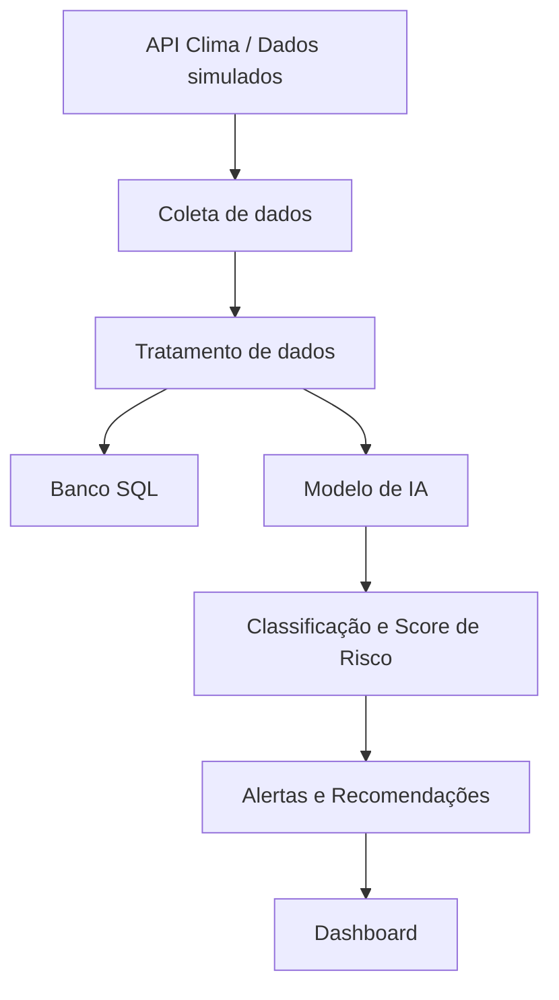

# 🚜 SOMPLE - Sistema de Predição de Risco para Equipamentos Agrícolas



## 1. Visão Geral do Projeto

O **SOMPLE** é um sistema de predição de risco operacional para equipamentos agrícolas. A proposta do projeto é apoiar operadores, gestores e seguradoras na identificação antecipada de situações que possam gerar atolamentos, falhas mecânicas, danos ao equipamento ou sinistros.

O projeto nasce a partir de um problema real do setor agrícola: muitas decisões ainda são tomadas de forma reativa, ou seja, somente depois que o incidente já aconteceu. Em operações agrícolas, esse atraso pode gerar prejuízos altos, paralisação da atividade, danos mecânicos e até perda total de equipamentos.

Cada etapa adiciona uma camada nova à solução, saindo da concepção inicial e avançando para uma integração funcional com dados, banco SQL, modelo preditivo, validação estatística e dashboard.

---

## 2. Descrição do Problema

O setor agrícola enfrenta baixa previsibilidade de riscos operacionais envolvendo máquinas e equipamentos.

Um exemplo prático ocorre quando uma operação é realizada após um período de chuva, em uma área com solo encharcado e equipamento pesado. Sem uma análise prévia, o operador pode entrar em uma região instável, aumentando o risco de atolamento, dano mecânico ou sinistro.

### Cenário de risco

- Operação realizada após período de chuva;
- Solo com alta umidade;
- Equipamento pesado em uso;
- Área próxima a corpos d'água;
- Terreno inclinado ou instável;
- Histórico de manutenção ou incidentes anteriores.

### Impactos do problema

- Alto custo de manutenção;
- Perda parcial ou total de equipamentos;
- Interrupção da operação agrícola;
- Aumento de sinistros para seguradoras;
- Redução da eficiência operacional;
- Tomada de decisão baseada em reação, não em prevenção.

---

## 3. Solução Proposta

A solução proposta é um sistema inteligente de **previsão de risco operacional**, baseado em dados ambientais e operacionais.

O SOMPLE utiliza informações como chuva, tipo de solo, umidade, inclinação, distância de corpos d'água, peso do equipamento, manutenção e histórico de incidentes para calcular o risco de uma operação.

O objetivo é transformar dados brutos em uma decisão preventiva:

```text
Dados ambientais + dados operacionais → modelo preditivo → score de risco → alerta → recomendação
```

### Funcionalidades principais

- Coleta e organização de dados ambientais e operacionais;
- Simulação de cenários reais de risco agrícola;
- Análise de padrões de risco;
- Classificação do nível de risco operacional;
- Cálculo de score de risco de 0 a 100;
- Geração de alertas preventivos;
- Recomendação operacional para apoiar a tomada de decisão;
- Visualização dos dados em dashboard.

### Saídas do sistema

- Classificação de risco: **baixo, médio, alto ou crítico**;
- Score de risco entre **0 e 100**;
- Alerta preventivo;
- Recomendação operacional;
- Métricas de validação do modelo;
- Visualização por equipamento e região.

---

## 4. Personas

### 4.1 Operador

O operador atua diretamente no campo e precisa de informações simples, rápidas e objetivas.

Seu principal objetivo é saber se a operação é segura ou se existe risco elevado antes de iniciar ou continuar uma atividade.

### Necessidades

- Receber alertas claros;
- Entender rapidamente o nível de risco;
- Evitar áreas perigosas;
- Reduzir exposição a atolamentos e danos ao equipamento.

---

### 4.2 Gestor de Frota

O gestor é responsável pela operação dos equipamentos agrícolas e pela tomada de decisão operacional.

Na Sprint 2, esta foi a persona central da User Story escolhida.

### User Story escolhida

> Como **gestor de frota**, quero visualizar o risco operacional por equipamento e região para tomar decisões preventivas antes da ocorrência de atolamentos, falhas mecânicas ou sinistros.

### Necessidades

- Visualizar riscos por equipamento;
- Acompanhar regiões críticas;
- Reduzir custos operacionais;
- Evitar paradas inesperadas;
- Usar dashboards para apoiar decisões.

---

### 4.3 Seguradora

A seguradora utiliza os dados para avaliar riscos, prever sinistros e apoiar decisões relacionadas à análise e precificação.

### Necessidades

- Identificar padrões de risco;
- Prever possíveis sinistros;
- Apoiar análise de perdas;
- Melhorar a precificação baseada em dados;
- Sair de uma atuação reativa para uma atuação preventiva.

---

## 5. Estrutura dos Dados

Os dados utilizados pelo SOMPLE são simulados, mas seguem uma lógica coerente com cenários reais de operação agrícola.

### Variáveis principais

| Variável | Descrição |
| --- | --- |
| chuva_mm | Quantidade de chuva em milímetros |
| tipo_solo | Tipo de solo, como argiloso, arenoso ou misto |
| umidade_solo | Percentual de umidade do solo |
| inclinacao / inclinacao_graus | Inclinação do terreno |
| distancia_agua_m | Distância em metros até corpos d'água |
| tipo_operacao | Tipo de atividade executada, como colheita, transporte ou pulverização |
| peso_equipamento / peso_equipamento_t | Peso do equipamento em toneladas |
| horas_uso | Tempo de uso do equipamento |
| dias_desde_manutencao | Quantidade de dias desde a última manutenção |
| manutencao | Situação da manutenção |
| incidentes_previos | Histórico de incidentes anteriores |
| falha | Ocorrência de falha |
| risco | Classificação final de risco |
| score_risco | Pontuação de risco de 0 a 100 |

### Exemplo de dataset inicial

| chuva_mm | tipo_solo | umidade_solo | inclinacao | tipo_operacao | peso | manutencao | risco |
| --- | --- | --- | --- | --- | --- | --- | --- |
| 30 | argiloso | 80 | 12 | colheita | 9 | nao | alto |
| 5 | arenoso | 20 | 3 | transporte | 6 | sim | baixo |
| 20 | argiloso | 60 | 8 | pulverizacao | 7 | sim | medio |

---

## 6. Regra Geral de Risco

Na primeira fase, o projeto utilizou regras simples para representar cenários de risco.

### Exemplo de regra inicial

```text
Se chuva > 25 mm
E tipo_solo = argiloso
E umidade_solo > 70%
Então risco = alto
```

Com a evolução da Sprint 2, essas regras deixam de ser apenas uma referência manual e passam a alimentar um fluxo mais completo, com dataset ampliado, banco SQL, modelo preditivo e dashboard.

---

## 7. Arquitetura da Solução

A arquitetura do SOMPLE foi planejada para evoluir progressivamente. Na Sprint 1, a arquitetura representava o fluxo conceitual da solução. Na Sprint 2, esse fluxo começa a ser implementado com scripts, banco de dados, modelo de Machine Learning e dashboard.



### Componentes da solução

- API de clima ou dados simulados;
- Dados simulados de solo e operação;
- Scripts de geração e tratamento de dados;
- Banco SQL para persistência;
- Modelo de IA para classificação de risco;
- Arquivos de saída com métricas e previsões;
- Dashboard para visualização;
- Alertas e recomendações operacionais.

---

## 8. Modelo Preditivo

O modelo preditivo tem como objetivo classificar o risco operacional de uma operação agrícola.

### Abordagem geral

A abordagem escolhida é a classificação supervisionada, pois o problema envolve prever categorias de risco com base em variáveis ambientais e operacionais.

### Entradas do modelo

- Dados climáticos;
- Dados do solo;
- Dados operacionais;
- Histórico de uso;
- Histórico de incidentes;
- Distância de corpos d'água;
- Condição de manutenção.

### Saídas do modelo

- Classificação do risco;
- Score de risco;
- Alerta preventivo;
- Recomendação operacional.

### Justificativa

A classificação é adequada porque entrega uma resposta clara para operadores e gestores. Em vez de apresentar apenas números soltos, o sistema traduz os dados em categorias objetivas e acionáveis.

---

## 9. Segurança e Governança

A solução considera princípios básicos de segurança, integridade e controle de acesso.

### Medidas previstas

- Autenticação de usuários;
- Controle de acesso por perfil;
- Proteção contra alteração indevida de dados;
- Registro de atividades;
- Validação dos dados de entrada;
- Separação entre visualização operacional e análise estratégica.

### Perfis de acesso

| Perfil | Permissão |
| --- | --- |
| Operador | Visualização de alertas operacionais |
| Gestor | Acesso ao dashboard completo |
| Seguradora | Acesso a dados analíticos e indicadores de risco |

---

# Evolução por Sprint

Abaixo está o histórico de evolução do projeto. A ideia é manter o README sempre vivo, adicionando novas seções conforme o SOMPLE evolui.

---

## Sprint 1 - Concepção da Solução

### Objetivo da Sprint 1

A Sprint 1 teve como objetivo estruturar a ideia do SOMPLE, definindo o problema, a solução proposta, as personas, as variáveis iniciais, a arquitetura conceitual e a lógica básica de risco.

Nesta fase, o projeto ainda era majoritariamente conceitual, mas já estabelecia a base necessária para as próximas entregas.

### Entregas principais

- Definição do problema de baixa previsibilidade de riscos operacionais;
- Descrição da solução proposta;
- Identificação das personas principais;
- Definição das variáveis iniciais do dataset;
- Criação de dataset simulado inicial;
- Definição da arquitetura conceitual;
- Planejamento das próximas etapas;
- Criação do README principal;
- Inclusão do vídeo de apresentação.

### Dataset inicial

Na Sprint 1, o dataset tinha o papel de demonstrar quais variáveis seriam relevantes para a análise de risco.

As variáveis principais eram:

- chuva_mm;
- tipo_solo;
- umidade_solo;
- inclinacao;
- tipo_operacao;
- peso_equipamento;
- horas_uso;
- manutencao;
- falha;
- risco.

### Modelo conceitual

A modelagem inicial era baseada em regras simples de risco, suficientes para explicar a lógica do sistema e justificar a proposta.

Exemplo:

```text
Chuva alta + solo argiloso + umidade elevada = maior risco operacional
```

### Planejamento definido na Sprint 1

| Sprint | Evolução planejada |
| --- | --- |
| Sprint 2 | Criação de dataset completo, simulação de dados e regras de risco |
| Sprint 3 | Treinamento do modelo de IA e validação dos resultados |
| Sprint 4 | Desenvolvimento da API e integração com frontend |
| Sprint 5 | Construção do dashboard, testes finais e melhorias |

### Vídeo de apresentação

https://youtu.be/04eJA7Vp_PU

### Conclusão da Sprint 1

A Sprint 1 consolidou a base conceitual do projeto. O SOMPLE passou a ter problema definido, solução estruturada, personas, variáveis, arquitetura e uma primeira simulação de dados.

Essa etapa foi importante porque organizou o raciocínio do projeto e preparou o caminho para a construção funcional da Sprint 2.

---

## Sprint 2 - Integração de Dados, SQL, Machine Learning e Dashboard

### Objetivo da Sprint 2

A Sprint 2 transforma o planejamento da Sprint 1 em uma primeira integração funcional.

Nesta etapa, o SOMPLE deixa de ser apenas uma proposta conceitual e passa a demonstrar um fluxo técnico completo:

```text
Dados simulados → tratamento → banco SQL → modelo preditivo → score de risco → alerta → recomendação → dashboard
```

O foco é provar que a solução consegue transformar dados brutos em uma saída útil para tomada de decisão preventiva.

---

### User Story trabalhada

> Como **gestor de frota**, quero visualizar o risco operacional por equipamento e região para tomar decisões preventivas antes da ocorrência de atolamentos, falhas mecânicas ou sinistros.

Essa User Story foi escolhida porque conecta diretamente o problema central do projeto com uma necessidade prática: o gestor precisa enxergar riscos antes que eles virem prejuízo.

---

### Estrutura adicionada na Sprint 2

```text
SOMPLE/
├── dashboard/
│   └── dashboard_somple.py
├── data/
│   ├── dataset_simulado.csv
│   └── dataset_sprint2.csv
├── docs/
│   ├── ARQUITETURA_SPRINT2.md
│   └── RELATORIO_VALIDACAO_SPRINT2.md
├── outputs/
│   ├── metricas_modelo.txt
│   ├── matriz_confusao.png
│   ├── importancia_variaveis.png
│   ├── correlacao_variaveis.csv
│   └── previsoes_risco.csv
├── scripts/
│   ├── gerar_dataset_sprint2.py
│   ├── gerar_inserts_sql.py
│   └── modelo_risco.py
├── sql/
│   ├── schema_sprint2.sql
│   └── inserts_sprint2.sql
└── requirements.txt
```

---

### O que evoluiu em relação à Sprint 1

| Elemento | Sprint 1 | Sprint 2 |
| --- | --- | --- |
| Dados | Dataset inicial e simples | Dataset ampliado para análise preditiva |
| Risco | Regras conceituais | Score de risco e classificação por modelo |
| Banco de dados | Planejamento | Scripts SQL de criação e inserção |
| IA | Abordagem proposta | Modelo Random Forest implementado |
| Validação | Não aplicada | Métricas, matriz de confusão e importância das variáveis |
| Interface | Planejada | Dashboard básico em Streamlit |
| Entrega | Documentação conceitual | Integração funcional com scripts executáveis |

---

### Como executar o projeto na Sprint 2

#### 1. Instalar dependências

```bash
pip install -r requirements.txt
```

#### 2. Gerar dataset completo da Sprint 2

```bash
python scripts/gerar_dataset_sprint2.py
```

#### 3. Treinar e validar o modelo

```bash
python scripts/modelo_risco.py
```

O script gera os arquivos de validação dentro da pasta `outputs`.

#### 4. Gerar inserts SQL

```bash
python scripts/gerar_inserts_sql.py
```

Depois, execute os arquivos abaixo no banco:

```text
sql/schema_sprint2.sql
sql/inserts_sprint2.sql
```

#### 5. Rodar dashboard

```bash
streamlit run dashboard/dashboard_somple.py
```

---

### Modelo preditivo da Sprint 2

O modelo utilizado foi o **Random Forest Classifier**.

Ele foi escolhido porque:

- funciona bem com variáveis numéricas e categóricas;
- permite classificar níveis de risco;
- gera importância das variáveis;
- é robusto para dados simulados com múltiplos fatores;
- entrega uma saída interpretável para apoiar decisões preventivas.

---

### Variáveis críticas da Sprint 2

As principais variáveis usadas para cálculo e previsão do risco são:

- chuva_mm;
- umidade_solo;
- tipo_solo;
- inclinacao_graus;
- distancia_agua_m;
- peso_equipamento_t;
- dias_desde_manutencao;
- incidentes_previos.

Essas variáveis representam fatores ambientais e operacionais que podem aumentar a chance de atolamento, falha mecânica ou dano ao equipamento.

---

### Saídas geradas na Sprint 2

O sistema gera:

- score de risco de 0 a 100;
- classificação: baixo, médio, alto ou crítico;
- alerta preventivo;
- recomendação operacional;
- métricas de validação do modelo;
- matriz de confusão;
- importância das variáveis;
- correlação das variáveis;
- arquivo com previsões de risco;
- visualização em dashboard.

---

### Evidências recomendadas para entrega

Para comprovar a execução da Sprint 2, recomenda-se incluir prints de:

1. terminal executando `gerar_dataset_sprint2.py`;
2. terminal executando `modelo_risco.py`;
3. arquivo `outputs/metricas_modelo.txt`;
4. imagem `outputs/matriz_confusao.png`;
5. imagem `outputs/importancia_variaveis.png`;
6. dashboard Streamlit aberto;
7. consultas SQL executadas no banco;
8. estrutura de pastas atualizada no GitHub.

---

### Conclusão da Sprint 2

A Sprint 2 comprova a evolução técnica do SOMPLE.

O projeto deixa de ser apenas uma ideia documentada e passa a ter uma base funcional composta por dados estruturados, scripts Python, persistência SQL, modelo de Machine Learning, validação estatística e dashboard.

Essa evolução é essencial porque aproxima o projeto de uma solução real para prevenção de riscos operacionais no campo.

---

## Próximas Evoluções

O README deve continuar sendo atualizado a cada nova Sprint, preservando o histórico do projeto e destacando a evolução técnica.

### Sprint 3 - Próxima etapa sugerida

- Refinar o modelo preditivo;
- Comparar diferentes algoritmos;
- Melhorar validação estatística;
- Criar métricas mais completas;
- Avaliar overfitting e generalização;
- Melhorar explicação das variáveis mais importantes.

### Sprint 4 - Próxima etapa sugerida

- Desenvolver API para consumo dos dados e previsões;
- Criar endpoints para consulta de risco por equipamento;
- Integrar backend com o modelo preditivo;
- Preparar comunicação com frontend.

### Sprint 5 - Próxima etapa sugerida

- Consolidar dashboard final;
- Melhorar experiência visual;
- Implementar filtros por equipamento, região e nível de risco;
- Simular alertas preventivos;
- Finalizar documentação e apresentação.

---

## Conclusão Geral

O SOMPLE propõe uma mudança importante na forma de lidar com riscos em equipamentos agrícolas.

Em vez de agir apenas após falhas, atolamentos ou sinistros, o sistema utiliza dados ambientais e operacionais para antecipar riscos e apoiar decisões preventivas.

A evolução entre as Sprints mostra o amadurecimento do projeto:

```text
Sprint 1: problema, solução, personas, variáveis e arquitetura conceitual
Sprint 2: dados estruturados, SQL, Machine Learning, validação e dashboard
```

Com isso, o SOMPLE se posiciona como uma solução de apoio à decisão para operadores, gestores e seguradoras, conectando análise de risco, inteligência artificial e prevenção operacional no setor agrícola.
