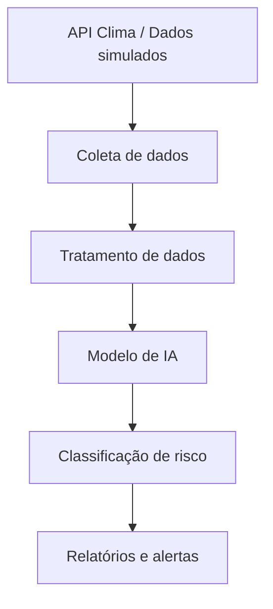

# 🚜 SOMPLE - Sistema de Predição de Risco para Equipamentos Agrícolas

## 1. Descrição do Problema

O setor agrícola enfrenta um problema crítico relacionado à baixa previsibilidade de riscos operacionais envolvendo equipamentos.

Atualmente, decisões são tomadas de forma reativa, ou seja, apenas após a ocorrência de falhas, acidentes ou prejuízos.

### Exemplo de cenário real

- Operação realizada após período de chuva
- Solo encharcado
- Equipamento pesado em uso

Resultado:
- Atolamento
- Danos mecânicos
- Possível perda total do equipamento

### Impactos do problema

- Alto custo de manutenção
- Perda de equipamentos
- Interrupção da operação
- Aumento de sinistros para seguradoras
- Redução da eficiência operacional

---

## 2. Solução Proposta

A proposta consiste em um sistema inteligente de **previsão de risco operacional**, que utiliza dados ambientais e operacionais para gerar alertas preventivos.

### Funcionalidades principais

- Coleta de dados de clima, solo e operação
- Análise de padrões de risco
- Classificação do nível de risco
- Geração de alertas preventivos

### Saídas do sistema

- Classificação de risco: **baixo / médio / alto**
- Score de risco (0 a 100)
- Alertas preventivos
- Recomendações operacionais

---

## 3. Personas (Usuários)

### Operador
- Atua diretamente no campo
- Precisa de alertas simples e rápidos
- Objetivo: evitar riscos durante a operação

### Gestor
- Responsável pela operação agrícola
- Precisa reduzir custos e falhas
- Utiliza dashboards para tomada de decisão

### Seguradora
- Avalia risco e sinistros
- Precisa prever perdas
- Utiliza dados para análise e precificação

---

## 4. Estrutura dos Dados

### Variáveis utilizadas

| Variável | Descrição |
|---|---|
| chuva_mm | Quantidade de chuva |
| tipo_solo | Tipo de solo (argiloso, arenoso, etc) |
| umidade_solo | Percentual de umidade do solo |
| inclinacao | Inclinação do terreno |
| tipo_operacao | Tipo de atividade (colheita, transporte, etc) |
| peso_equipamento | Peso em toneladas |
| horas_uso | Tempo de uso do equipamento |
| manutencao | Situação da manutenção |
| falha | Ocorrência de falha |

---

### Exemplo de Dataset

| chuva_mm | tipo_solo | umidade_solo | inclinacao | tipo_operacao | peso | manutencao | risco |
|---|---|---|---|---|---|---|---|
| 30 | argiloso | 80 | 12 | colheita | 9 | nao | alto |
| 5 | arenoso | 20 | 3 | transporte | 6 | sim | baixo |
| 20 | argiloso | 60 | 8 | pulverizacao | 7 | sim | medio |

---

## 5. Arquitetura da Solução

### Componentes

- API de clima (dados ambientais)
- Dados simulados de solo e operação
- Backend para processamento
- Modelo de IA para análise
- Interface para visualização

---

## 6. Modelo Preditivo

### Abordagem

Classificação de risco com base em variáveis ambientais e operacionais.

### Entradas

- Dados climáticos
- Dados do solo
- Dados operacionais
- Histórico de uso

### Saída

- Risco: baixo, médio ou alto

### Justificativa

A classificação permite decisões rápidas e práticas no campo, sendo mais eficiente para operadores e gestores do que análises complexas.

---

## 7. Planejamento das Próximas Etapas

### Sprint 2
- Criação do dataset completo
- Simulação de dados
- Definição de regras de risco

### Sprint 3
- Treinamento do modelo de IA
- Validação dos resultados

### Sprint 4
- Desenvolvimento da API
- Integração com frontend

### Sprint 5
- Construção do dashboard
- Testes finais
- Ajustes e melhorias

---

## 8. Segurança

A solução considera:

- Autenticação de usuários
- Controle de acesso por perfil
- Proteção contra alteração indevida de dados
- Registro de atividades

### Perfis

| Perfil | Permissão |
|---|---|
| Operador | Visualização de alertas |
| Gestor | Acesso ao dashboard completo |
| Seguradora | Acesso a dados analíticos |

---

## 9. Simulação de Dados

Os dados utilizados nesta fase são simulados, mas baseados em cenários reais.

### Exemplo de regra

- Se chuva > 25 mm
- E solo = argiloso
- E umidade > 70

→ risco = alto

---

## 10. Vídeo de Apresentação

---

## 11. Conclusão

A solução proposta transforma a análise de risco de um modelo reativo para um modelo preditivo, permitindo antecipação de problemas e redução de prejuízos.

O sistema utiliza dados ambientais e operacionais para apoiar decisões mais seguras, eficientes e inteligentes no setor agrícola.