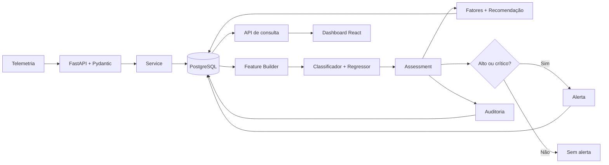
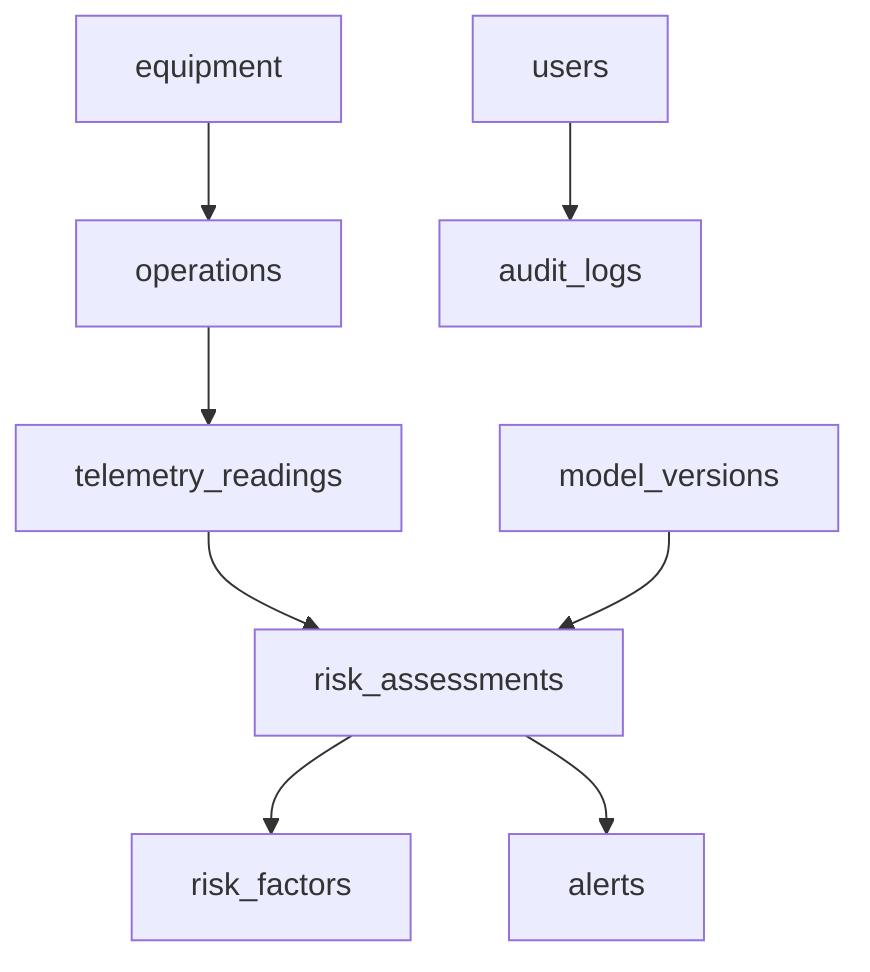
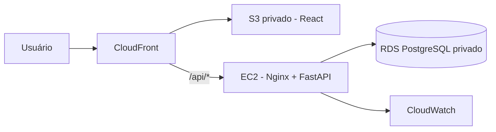

# SOMPLE — Sistema Inteligente de Predição de Riscos para Equipamentos Agrícolas

O **SOMPLE** é um protótipo desenvolvido para o Challenge da **Sompo Seguros na FIAP**. A solução cruza dados ambientais, operacionais e históricos para antecipar situações que podem causar danos ou perdas em equipamentos agrícolas.

A partir de uma telemetria, o sistema produz **score de risco de 0 a 100**, **nível de risco**, **confiança**, **fatores relevantes**, **recomendação preventiva** e, nos níveis alto ou crítico, um **alerta**. O resultado fica persistido e auditável, permitindo que operadores, gestores e seguradora atuem antes do incidente.

> Este README centraliza a documentação necessária para compreender, executar e avaliar a Sprint 3. Os READMEs internos são complementares.

## Sumário

- [Desafio](#desafio)
- [Objetivo da solução](#objetivo-da-solução)
- [Evolução do projeto](#evolução-do-projeto)
- [Arquitetura de software](#arquitetura-de-software)
- [Arquitetura do backend](#arquitetura-do-backend)
- [Módulos existentes](#módulos-existentes)
- [Fluxo de dados de ponta a ponta](#fluxo-de-dados-de-ponta-a-ponta)
- [Modelo de Inteligência Artificial](#modelo-de-inteligência-artificial)
- [Engenharia de dados e PostgreSQL](#engenharia-de-dados-e-postgresql)
- [Segurança da informação](#segurança-da-informação)
- [Dashboard](#dashboard)
- [Aderência às User Stories](#aderência-às-user-stories)
- [Tecnologias utilizadas](#tecnologias-utilizadas)
- [Executando localmente](#executando-localmente)
- [Como gerar um novo score de risco](#como-gerar-um-novo-score-de-risco)
- [Implantação na AWS — bônus](#implantação-na-aws--bônus)
- [Evidências de execução](#evidências-de-execução)
- [Atendimento aos requisitos da Sprint 3](#atendimento-aos-requisitos-da-sprint-3)
- [Decisões técnicas](#decisões-técnicas)
- [Limitações e próximos passos](#limitações-e-próximos-passos)
- [Checklist de entrega](#checklist-de-entrega)

## Desafio

O desafio proposto pela Sompo é identificar fatores ambientais e operacionais associados ao aumento do risco de danos, perdas, colisões, atolamentos, operações próximas à água, problemas durante transporte e outras situações relevantes no uso de equipamentos agrícolas.

```text
Abordagem tradicional: evento → dano → reação
SOMPLE:              dados → análise → previsão → alerta → prevenção
```

Chuva, umidade e tipo do solo, inclinação, proximidade de água, tipo de operação, peso do equipamento, manutenção e incidentes anteriores passam a compor uma avaliação rastreável, em vez de serem analisados isoladamente depois de um sinistro.

## Objetivo da solução

O SOMPLE integra telemetria, contexto ambiental, dados operacionais, histórico, PostgreSQL, modelo preditivo, API e dashboard. A solução oferece:

- ao **operador**, uma indicação objetiva do risco da operação;
- ao **gestor**, visão da frota, equipamentos prioritários, evolução e alertas;
- à **seguradora**, histórico rastreável para análise preventiva e governança da IA.

```text
Dados ambientais e operacionais
        ↓
Backend FastAPI e validação Pydantic
        ↓
PostgreSQL + Feature Builder
        ↓
Modelo de Machine Learning
        ↓
Score + classificação + confiança
        ↓
Fatores de risco + recomendação
        ↓
Alertas + auditoria
        ↓
Dashboard React
```

## Evolução do projeto

| Etapa | Objetivo | Resultado confirmado no histórico do repositório |
| --- | --- | --- |
| Sprint 1 | Estruturar problema, solução, personas, variáveis e arquitetura conceitual | Base conceitual, dataset inicial e regras de risco |
| Sprint 2 | Desenvolver dados, persistência SQL, modelo e primeira visualização | Dataset simulado, Random Forest Classifier, métricas e dashboard experimental em Streamlit |
| Sprint 3 | Integrar os componentes em um MVP funcional | FastAPI modular, PostgreSQL, pipeline transacional de inferência, JWT, auditoria, React integrado e Docker Compose |

### O que mudou da Sprint 2 para a Sprint 3

| Sprint 2 | Sprint 3 |
| --- | --- |
| Modelo executado por script | Modelo versionado e carregado pelo backend |
| Dataset usado diretamente no treinamento e análise | Telemetria recebida pela API e contexto recuperado do PostgreSQL |
| Predição experimental | Predição acionada por endpoint autenticado |
| Saídas em arquivos e dashboard experimental | Telemetria, assessment, fatores e alertas persistidos |
| Execução manual do pipeline | Pipeline orquestrado por service em uma transação |
| Dashboard Streamlit da etapa experimental | Aplicação React + TypeScript consumindo a API |
| Análise pontual | Histórico de assessments e trilha de auditoria |
| Resultado técnico do modelo | Score, explicação, recomendação e alerta utilizáveis pela aplicação |

Principais evoluções da Sprint 3:

- backend FastAPI organizado por módulos e camadas;
- PostgreSQL com migrations, índices e views;
- integração do artefato de ML com o fluxo de telemetria;
- persistência de leituras, assessments, snapshots, fatores e alertas;
- recomendações e explicações dos fatores de risco;
- autenticação JWT, senha com Argon2 e endpoints protegidos;
- auditoria funcional de login, logout, telemetria, assessments e alertas;
- dashboard React integrado via Axios e TanStack React Query;
- ambiente local reproduzível com Docker Compose;
- preparação documental e técnica para uma futura implantação na AWS.

## Arquitetura de software

```text
SOMPLE/
├── somple-frontend/
│   ├── src/api/                 # rotas, contratos e controllers HTTP
│   ├── src/components/          # componentes reutilizáveis
│   ├── src/pages/               # telas e estados da interface
│   └── src/router/              # rotas públicas e protegidas
├── somple-backend/
│   ├── api/v1/                  # composição das rotas versionadas
│   ├── core/                    # configuração, banco, JWT e observabilidade
│   ├── ml/                      # features, runtime, explicação e treinamento
│   ├── modules/                 # módulos funcionais da API
│   ├── scripts/                 # carga de demonstração
│   ├── utils/                   # erros, datas e regras compartilhadas
│   └── main.py                  # inicialização do FastAPI
├── somple-infra/
│   ├── database/                # migrations, seed e documentação do modelo
│   ├── docker/                  # imagens do backend, frontend e proxy
│   ├── aws/                     # arquitetura-alvo de nuvem
│   ├── docker-compose.yml       # ambiente local
│   └── docker-compose.aws.yml   # backend/proxy preparado para EC2
├── .env.example
└── README.md
```

| Responsabilidade | Camada |
| --- | --- |
| Apresentação e interação | `somple-frontend` |
| API e regras de negócio | `somple-backend/modules` |
| Persistência e consultas | repositories + PostgreSQL |
| Inteligência artificial | `somple-backend/ml` |
| Containers, banco e referência cloud | `somple-infra` |

A arquitetura AWS é uma evolução adicional de implantação e não substitui essa arquitetura de software.

## Arquitetura do backend

Cada módulo funcional segue o fluxo predominante:

```text
Router → Service → Repository → PostgreSQL
```

### Router

Define endpoints, parâmetros, schemas de entrada e saída e dependências de autenticação. A validação estrutural ocorre automaticamente com Pydantic.

### Service

Concentra regras de negócio e orquestra transações. No módulo de telemetria, coordena persistência, montagem de features, inferência, explicação, recomendação, alerta e auditoria.

### Repository

Executa consultas, inserções e atualizações no PostgreSQL, sem concentrar regras de apresentação.

| Pasta | Responsabilidade |
| --- | --- |
| `api` | Agregar os routers sob `/api/v1` |
| `core` | Configurações, pool do banco, segurança, autorização e logs HTTP |
| `modules` | Separar recursos e regras por domínio funcional |
| `ml` | Treinamento, artefato, runtime, Feature Builder, explicação e recomendações |
| `scripts` | Preparar dados do ambiente de demonstração |
| `utils` | Exceções, datas e classificação compartilhada de risco |

## Módulos existentes

| Módulo | Responsabilidade confirmada |
| --- | --- |
| Health | Healthcheck simples e readiness do banco/modelo |
| Auth | Login, emissão de JWT e logout auditado |
| Dashboard | KPIs, score da frota, ranking, evolução, distribuição e alertas recentes |
| Monitoring | Estado mais recente dos equipamentos e telemetrias, com filtros |
| Equipment | Listagem e detalhe de equipamentos e avaliações recentes |
| Operations | Consulta das operações e seus indicadores de risco |
| Telemetry | Ingestão e execução do pipeline completo de avaliação |
| Assessment | Detalhe de score, modelo, entradas, fatores e recomendação |
| Alerts | Listagem e atualização de status de alertas |
| Audit | Histórico filtrável de avaliações e rastreabilidade |

## Fluxo de dados de ponta a ponta

1. O cliente envia `POST /api/v1/telemetry` com Bearer Token.
2. FastAPI e Pydantic validam o corpo e seus limites.
3. O service confirma que a operação existe.
4. A leitura é persistida em `telemetry_readings`.
5. O `FeatureBuilder` combina telemetria com operação, equipamento, última manutenção e incidentes anteriores.
6. O runtime carrega o `.joblib` e executa classificador e regressor.
7. O sistema calcula nível, score e confiança.
8. O explainer identifica até cinco fatores e gera uma recomendação.
9. Assessment, snapshots e fatores são persistidos.
10. Riscos `high` ou `critical` geram alerta.
11. Eventos funcionais são gravados em `audit_logs`.
12. A transação é confirmada e IDs e resultado retornam ao cliente.
13. Dashboard e telas de detalhe consultam os dados pela API.



## Modelo de Inteligência Artificial

O artefato atual evolui o trabalho da Sprint 2 e está integrado ao backend como `somple-risk-classifier`, versão `1.0.0`:

- **Random Forest Classifier** classifica `low`, `medium`, `high` ou `critical`;
- **Random Forest Regressor** produz o score de 0 a 100.

O pipeline aplica `OneHotEncoder` às variáveis categóricas e serializa classificador, regressor e metadados em Joblib. O backend carrega esse artefato no runtime; não é necessário retreiná-lo para executar o MVP.

### Métricas registradas no artefato

| Métrica | Valor | Interpretação curta |
| --- | --- | --- |
| Accuracy | **84,44%** (`0.8444`) | Proporção de classes previstas corretamente no teste |
| MAE | **7,79 pontos** (`7.7862`) | Erro absoluto médio do score previsto |
| R² | **0,686** | Parcela da variação do score explicada pelo regressor |

As métricas vêm de `somple-backend/ml/artifacts/somple-risk-classifier-v1.0.0.json` e refletem o dataset `sprint2-v1`.

### Dados utilizados pelo modelo

| Feature | Origem e significado |
| --- | --- |
| `chuva_mm` | Volume de chuva da telemetria |
| `temperatura_c` | Temperatura ambiente da telemetria |
| `umidade_solo` | Percentual de umidade do solo |
| `tipo_solo` | Característica categórica do terreno |
| `inclinacao_graus` | Inclinação do terreno |
| `distancia_agua_m` | Distância até corpo d'água |
| `tipo_operacao` | Atividade registrada na operação |
| `peso_equipamento_t` | Peso cadastrado do equipamento |
| `dias_desde_manutencao` | Dias desde a manutenção mais recente; usa 365 sem registro |
| `incidentes_previos` | Incidentes do equipamento anteriores à leitura |

O `Explainer` tenta usar SHAP e possui fallback baseado na importância das features. Os fatores são explicações do modelo, não novas medições.

### Treinamento opcional

```bash
cd somple-infra
docker compose --env-file ../.env exec backend python ml/training/train_model.py
```

O retreinamento substitui o artefato local de versão `1.0.0`. Depois, recrie o backend para carregá-lo em um processo limpo. Para a demonstração normal, o artefato versionado é suficiente.

## Engenharia de dados e PostgreSQL

O PostgreSQL é a fonte persistente da aplicação.

| Grupo | Entidades |
| --- | --- |
| Identidade e organização | `users`, `customers`, `regions` |
| Contexto operacional | `equipment`, `maintenance_records`, `incidents`, `operations` |
| Entrada | `telemetry_readings` |
| IA | `model_versions`, `risk_assessments`, `risk_factors` |
| Ação e governança | `alerts`, `audit_logs` |



- `input_snapshot` preserva o vetor exato enviado ao modelo.
- `output_snapshot` guarda probabilidades e métodos de score/explicação.
- `model_version_id` relaciona a decisão ao artefato ativo e às métricas.
- `audit_logs` registra ator, evento, entidade, request ID, endpoint, método, status e metadados.

Isso permite reconstruir uma inferência e trata auditoria como governança da IA, não apenas log técnico.

As migrations em `somple-infra/database/migrations` são montadas em `/docker-entrypoint-initdb.d` e executadas automaticamente pelo PostgreSQL **somente na criação de um volume vazio**.

## Segurança da informação

| Mecanismo | Estado e finalidade |
| --- | --- |
| JWT + Bearer Token | Implementado; autentica chamadas e expira conforme `JWT_EXP_HOURS` |
| Argon2 | Implementado; armazena hash, nunca senha em texto puro no banco |
| Endpoints protegidos | Implementado para todos os módulos, exceto health e login |
| Perfis no token | `admin`, `analyst` e `operator` são persistidos e incluídos no JWT |
| Autorização por perfil | **Parcialmente implementada no MVP**: existe `require_roles`, mas os routers exigem apenas autenticação |
| CORS | Configurável por `CORS_ORIGINS` |
| Variáveis de ambiente | Configuração e segredos ficam fora do código; somente exemplos são versionados |
| Auditoria | Login, logout, telemetria, assessment e eventos de alerta possuem registro |

```text
Usuário autenticado → JWT → endpoint protegido → operação → audit_logs
```

O logout é auditado, mas não revoga o token no servidor; o frontend remove o token local. Não use credenciais acadêmicas ou valores do `.env.example` em produção.

## Dashboard

O frontend usa **React 19**, **TypeScript**, **Vite**, **TanStack React Query**, **Axios**, **React Router**, **Recharts**, **Tailwind CSS** e componentes baseados em **shadcn/Base UI**.

Ele consome exclusivamente a API configurada em `VITE_API_BASE_URL`; não acessa o PostgreSQL diretamente. O Axios envia o Bearer Token e redireciona respostas `401` para o login.

Recursos confirmados:

- login e rotas autenticadas;
- KPIs, score geral, ranking, evolução e distribuição do risco e alertas recentes;
- monitoramento com resumo, tabela e filtros;
- lista e detalhe de equipamentos;
- operações, central de alertas e histórico de auditoria;
- detalhe do assessment com entradas, fatores e recomendação.

O React atende à apresentação dos resultados e mantém interface, backend Python e IA desacoplados.

## Aderência às User Stories

| Necessidade da Sompo | Implementação | Situação |
| --- | --- | --- |
| Score por equipamento/operação | Assessments, APIs e dashboard | Implementado no MVP |
| Fatores ambientais e operacionais | Feature Builder + modelo + Risk Factors | Implementado no MVP |
| Alertas preventivos | Alerta automático em risco alto/crítico | Implementado no MVP |
| Recomendações | Recomendação associada ao assessment/alerta | Implementado no MVP |
| Explicabilidade | SHAP/fallback e fatores persistidos | Implementado no MVP |
| Histórico | PostgreSQL e telas de detalhe/auditoria | Implementado no MVP |
| Auditoria | `audit_logs` e snapshots | Implementado no MVP |
| Entrada de telemetria | `POST /api/v1/telemetry` | Implementado no MVP |
| Visualização | Dashboard React integrado | Implementado no MVP |
| Restrições por perfil | Roles existem, sem aplicação nos routers | Parcialmente implementado no MVP |
| Fontes reais de clima/IoT | API aceita telemetria, sem integração externa | Parcialmente implementado no MVP |

## Tecnologias utilizadas

| Camada | Tecnologias confirmadas |
| --- | --- |
| Backend | Python 3.12, FastAPI, Pydantic, Uvicorn, psycopg |
| IA | Pandas, NumPy, Scikit-learn, Joblib, SHAP |
| Banco | PostgreSQL 16, SQL e JSONB |
| Frontend | React 19, TypeScript, Vite, React Query, Axios, React Router |
| Visualização | Recharts |
| Interface | Tailwind CSS, shadcn, Base UI, Lucide React |
| Infraestrutura local | Docker, Docker Compose, Nginx |
| Segurança | PyJWT, Argon2, Bearer Token, CORS |
| Cloud planejada | AWS EC2, RDS, S3, CloudFront e CloudWatch |

## Executando localmente

### Pré-requisitos

- [Git](https://git-scm.com/downloads);
- [Docker Desktop](https://www.docker.com/products/docker-desktop/), com Docker Engine e Compose.

No Windows, inicie o Docker Desktop e aguarde o engine ficar disponível.

### 1. Clone o repositório

```bash
git clone https://github.com/EnzoCaetano015/SOMPLE.git
cd SOMPLE
```

### 2. Configure o ambiente

O Compose local usa o `.env.example` da **raiz**.

Linux/macOS:

```bash
cp .env.example .env
```

Windows PowerShell:

```powershell
Copy-Item .env.example .env
```

Antes de um ambiente compartilhado, altere pelo menos `POSTGRES_PASSWORD` e `JWT_SECRET_KEY`. Não versione `.env`.

### 3. Suba os containers

```bash
cd somple-infra
docker compose --env-file ../.env up -d --build
```

- `--env-file ../.env`: carrega as variáveis da raiz;
- `up`: cria e inicia os serviços;
- `-d`: executa em segundo plano;
- `--build`: reconstrói as imagens.

```bash
docker compose --env-file ../.env ps
```

Os containers são `somple-db`, `somple-backend` e `somple-frontend`.

### 4. Carregando os dados de demonstração

```bash
docker compose --env-file ../.env exec backend python -m scripts.create_demo_data
```

O comando executa `create_demo_data.py` como módulo Python a partir do diretório `/app` do container backend. O script cria/atualiza uma fazenda, três regiões, três usuários, seis equipamentos, seis operações, manutenções preventivas e a versão ativa do modelo. Ele não cria telemetrias ou assessments; esses dados surgem pelo endpoint de telemetria.

### Credenciais de demonstração

| Perfil | Usuário | Senha acadêmica |
| --- | --- | --- |
| Administrador | `admin@somple.com` | `Somple@123` |
| Analista | `analista@somple.com` | `Somple@123` |
| Operador | `operador@somple.com` | `Somple@123` |

> **Atenção:** credenciais exclusivas do ambiente acadêmico/de demonstração. Não reutilize em produção.

### 5. Acesse os serviços

| Serviço | URL local |
| --- | --- |
| Frontend | `http://localhost:8080` |
| API | `http://localhost:8000` |
| Swagger | `http://localhost:8000/docs` |
| OpenAPI JSON | `http://localhost:8000/openapi.json` |
| PostgreSQL | `localhost:5432` |

### 6. Valide a API

```bash
curl http://localhost:8000/api/v1/health
curl http://localhost:8000/api/v1/health/ready
```

O primeiro retorna `{"status":"ok"}`. Quando banco e modelo estão disponíveis, o segundo informa `status: "ready"`, `database: "ok"`, `model: "ok"` e a versão.

## Como gerar um novo score de risco

O frontend consulta e apresenta resultados, mas não possui formulário de ingestão. Use o Swagger:

1. abra `http://localhost:8000/docs`;
2. execute `POST /api/v1/auth/login` com uma credencial de demonstração;
3. copie o `access_token`;
4. clique em **Authorize** e informe o token;
5. execute `GET /api/v1/operations` e escolha um `id`;
6. execute `POST /api/v1/telemetry` com esse `operation_id`;
7. observe IDs, score, nível, confiança e indicação de alerta;
8. consulte `GET /api/v1/assessments/{assessment_id}`;
9. atualize `http://localhost:8080` para conferir o resultado persistido.

Exemplo — ajuste `operation_id` para um ID retornado pela API:

```json
{
  "operation_id": 1,
  "recorded_at": "2026-08-20T15:00:00Z",
  "rainfall_mm": 42,
  "temperature_c": 29,
  "soil_moisture_pct": 88,
  "soil_type": "argiloso",
  "slope_degrees": 16,
  "distance_to_water_m": 25,
  "speed_kmh": 8,
  "latitude": -23.55052,
  "longitude": -46.633308,
  "source": "manual"
}
```

O nível depende do modelo; não se deve presumir que um payload sempre produzirá alerta.

### Parando o projeto

```bash
docker compose --env-file ../.env down
```

Executado em `somple-infra`, o comando preserva o volume do PostgreSQL.

### Reset completo do banco

> **Atenção:** remove o volume do PostgreSQL e apaga todos os dados locais.

```bash
docker compose --env-file ../.env down -v
docker compose --env-file ../.env up -d --build
docker compose --env-file ../.env exec backend python -m scripts.create_demo_data
```

No volume novo, o PostgreSQL executa automaticamente `001_schema.sql`, `002_indexes.sql`, `003_views.sql` e `004_frontend_views.sql`. Em volume existente, editar uma migration não a reaplica.

## Implantação na AWS — bônus

> A AWS não é necessária para compreender a arquitetura principal. O repositório contém arquitetura-alvo e preparação para uma possível implantação.



### Estado confirmado

- `docker-compose.aws.yml` prepara backend e proxy Nginx para EC2;
- `aws/ARCHITECTURE.md` descreve S3, CloudFront, EC2, RDS, CloudWatch e Security Groups como topologia recomendada;
- o frontend gera build estático compatível com S3;
- a API aceita `DATABASE_URL` para PostgreSQL externo.

### Estado não comprovado

Não há evidência versionada de recursos AWS provisionados, URLs públicas, pipeline de publicação ou arquivo `.env.aws.example`. A implantação deve ser tratada como **planejada/preparada**, não concluída.

O Compose AWS exige `somple-infra/.env.aws`, não versionado, com variáveis como `APP_ENV`, `CORS_ORIGINS`, `DATABASE_URL`, `JWT_SECRET_KEY`, `JWT_ALGORITHM`, `JWT_EXP_HOURS` e `MODEL_NAME`.

Após preparar o arquivo e provisionar RDS/EC2, a parte prevista para a EC2 é:

```bash
cd somple-infra
docker compose -f docker-compose.aws.yml up -d --build
docker compose -f docker-compose.aws.yml ps
docker compose -f docker-compose.aws.yml exec backend python -m scripts.create_demo_data
curl http://localhost/api/v1/health/ready
```

S3, CloudFront, DNS, certificados, RDS e Security Groups dependem dos recursos reais da conta acadêmica e ainda precisam de evidências.

## Evidências de execução

Não existem capturas da Sprint 3 no repositório. Para evitar imagens falsas e links quebrados, os espaços abaixo indicam o que capturar. Estrutura sugerida:

```text
docs/evidencias/
├── local/
├── aws/
└── dashboard/
```

### Ambiente local

- **Pendente — Docker Desktop:** três containers ativos.
- **Pendente — terminal:** Compose e `docker compose ps`.
- **Pendente — healthcheck:** `/health` e `/health/ready`.
- **Pendente — carga:** mensagem `Demo data created.`.
- **Pendente — Swagger:** login e resposta da telemetria.

### Dashboard

- **Pendente — visão geral:** KPIs, score, ranking e gráficos.
- **Pendente — assessment:** score, confiança, fatores e recomendação.
- **Pendente — alertas:** alerta persistido e exibido.
- **Pendente — auditoria:** histórico do fluxo.

### AWS — somente após implantação real

- **Pendente — Console:** somente serviços realmente usados.
- **Pendente — EC2:** conexão, Compose, containers, healthcheck e carga.
- **Pendente — aplicação publicada:** dashboard na URL real.

Legenda recomendada: **Figura — Dashboard SOMPLE executando em ambiente AWS.**

### Sequência recomendada de evidências

1. infraestrutura e containers;
2. PostgreSQL e migrations;
3. backend e readiness;
4. carga de demonstração;
5. login e JWT;
6. telemetria recebida;
7. modelo executado;
8. score e fatores gerados;
9. assessment persistido;
10. alerta criado quando aplicável;
11. auditoria e dashboard;
12. aplicação hospedada, se a AWS for concluída.

## Atendimento aos requisitos da Sprint 3

| Requisito | Implementação confirmada |
| --- | --- |
| Backend integrador | FastAPI modular sob `/api/v1` |
| Banco de dados | PostgreSQL com schema, índices e views |
| Pipeline de dados | Transação de telemetria até auditoria |
| Integração com modelo | Runtime Joblib com classificador e regressor |
| Telemetria | Endpoint autenticado e persistência |
| Validação | Pydantic, regras de service e constraints SQL |
| Segurança | JWT, Bearer, Argon2, CORS e rotas protegidas |
| Auditoria | Snapshots, versão do modelo e `audit_logs` |
| Dashboard | React integrado às APIs |
| Docker | Compose local com frontend, backend e banco |
| Documentação | README centralizado |
| Arquitetura | Frontend/backend/infra e router/service/repository |
| AWS | Preparação e arquitetura-alvo; deploy não comprovado |

## Decisões técnicas

### FastAPI

Mantém backend e ML em Python, valida entradas com Pydantic e gera Swagger automaticamente.

### PostgreSQL

Oferece integridade relacional, histórico, auditoria, JSONB para snapshots e consultas analíticas.

### React

Separa apresentação das regras, permite componentes reutilizáveis e visualiza scores, fatores, gráficos e alertas. Atende ao requisito de interface; não é necessário substituí-lo por framework Python.

### Docker

Padroniza Python, Node/Nginx e PostgreSQL, reduz diferenças entre máquinas e simplifica a demonstração.

### Modelo no mesmo backend

Para o MVP, o runtime permanece no FastAPI. Um microsserviço separado adicionaria complexidade sem benefício proporcional ao escopo.

## Limitações e próximos passos

- Dados de treinamento e demonstração predominantemente simulados.
- Integrações diretas com IoT e APIs meteorológicas ainda não existem.
- A base de roles existe, mas políticas por perfil ainda precisam ser aplicadas.
- O logout não possui blacklist/revogação de JWT no servidor.
- Alertas não disparam notificações externas.
- Drift, monitoramento e retreinamento não estão automatizados.
- A implantação AWS precisa ser executada e comprovada.
- Georreferenciamento, tempo real e histórico real de sinistros podem ampliar o MVP.

## Checklist de entrega

- [x] Backend Python integrado
- [x] Banco PostgreSQL
- [x] Modelo de IA integrado
- [x] Pipeline de telemetria
- [x] Score e classificação
- [x] Fatores e recomendações
- [x] Alertas
- [x] Auditoria
- [x] Dashboard React
- [x] Docker Compose local
- [x] Documentação principal
- [ ] Aplicar autorização específica por perfil
- [ ] Comprovar implantação AWS, caso usada
- [ ] Adicionar prints finais
- [ ] Produzir o vídeo de demonstração

## Vídeo de demonstração

O vídeo de demonstração da Sprint 3 será adicionado antes da entrega final.
