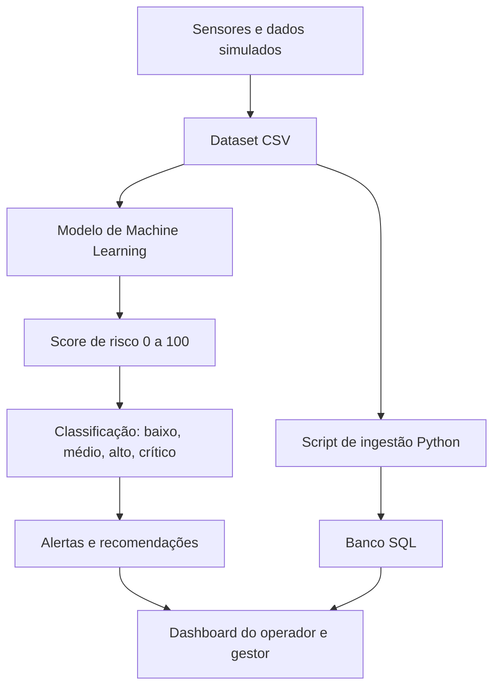

# Arquitetura Consolidada - SOMPLE

## Fluxo técnico



## Componentes

### 1. Coleta de dados

Nesta Sprint, a coleta é simulada por meio do arquivo `data/dataset_sprint2.csv`.

Em uma solução real, esses dados poderiam vir de:

- sensores de umidade do solo;
- APIs meteorológicas;
- GPS do equipamento;
- histórico de manutenção;
- registros de incidentes anteriores.

### 2. Banco de dados SQL

O banco registra:

- equipamentos;
- leituras operacionais;
- previsões de risco;
- métricas do modelo.

O script está em:

```text
sql/schema_sprint2.sql
```

### 3. Inteligência preditiva

O modelo fica em:

```text
scripts/modelo_risco.py
```

Ele recebe as variáveis do dataset, treina um classificador e gera:

- acurácia;
- matriz de confusão;
- importância das variáveis;
- previsões de risco.

### 4. Dashboard

O dashboard fica em:

```text
dashboard/dashboard_somple.py
```

Ele permite visualizar:

- score médio;
- quantidade de riscos críticos;
- evolução do risco;
- alertas por equipamento/região.

## Segurança e governança

A proposta considera:

- controle de acesso por perfil;
- integridade dos dados por chaves primárias e estrangeiras;
- validação de score entre 0 e 100;
- rastreabilidade da previsão por registro operacional;
- separação entre dados brutos, modelo e saída analítica.
