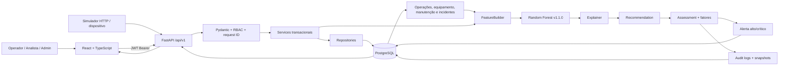
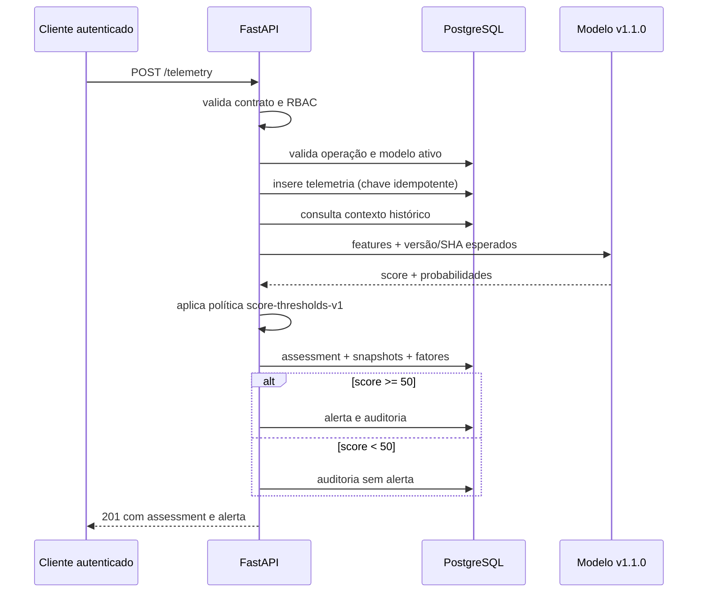

# Arquitetura do SOMPLE

## Componentes executados

O frontend nunca acessa o PostgreSQL diretamente. Autenticação e autorização são aplicadas na API antes das operações protegidas.

## Sequência de inferência

## Implantação

O ambiente reproduzível usa Docker Compose com PostgreSQL 16, backend FastAPI e frontend servido por Nginx. A implantação AWS registrada anteriormente é acadêmica e usa HTTP; não representa uma topologia de produção. IoT, clima externo, mensageria e notificações não fazem parte da execução atual.
