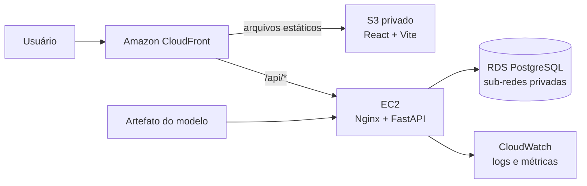

# Arquitetura AWS alvo — SOMPLE Sprint 3

## Arquitetura recomendada



## Por que essa topologia

### Frontend

O build do React/Vite gera arquivos estáticos. A versão de produção deve ser enviada para um bucket S3 e distribuída pelo CloudFront.

O frontend não acessa o RDS. Ele conversa somente com a API.

### Backend

A EC2 executa:

```text
Nginx :80
   ↓
FastAPI :8000
   ↓
RDS PostgreSQL :5432
```

No MVP, FastAPI e o artefato `.joblib` ficam no mesmo serviço. Separar o modelo em um microsserviço nesta Sprint aumentaria a complexidade sem melhorar o fluxo exigido pela faculdade.

### Banco

O RDS PostgreSQL deve ficar **sem acesso público**. O Security Group do banco aceita `5432` somente do Security Group da EC2.

## CloudFront com duas origens

Para evitar frontend HTTPS chamando uma API HTTP diretamente:

- origem padrão: bucket S3;
- comportamento `/api/*`: origem EC2/Nginx;
- usuário acessa tudo pelo mesmo domínio HTTPS do CloudFront.

Exemplo:

```text
https://xxxxx.cloudfront.net/              -> S3 / React
https://xxxxx.cloudfront.net/api/v1/...    -> EC2 / FastAPI
```

Quando o backend estiver implementado, prefira versionar os endpoints sob `/api/v1`.

## Security Groups

### `somple-api-sg`

Entrada:

| Porta | Origem | Finalidade |
|---|---|---|
| 80 | CloudFront / origem permitida no laboratório | API através do proxy |
| 22 | somente IP administrativo, se realmente necessário | manutenção |

Saída:

- `5432` para o Security Group do RDS;
- HTTPS para serviços externos necessários.

### `somple-db-sg`

Entrada:

| Porta | Origem |
|---|---|
| 5432 | `somple-api-sg` |

Nenhuma regra pública para PostgreSQL.

## Variáveis na EC2

Criar `.env.aws` a partir de `.env.aws.example`.

Nunca colocar credenciais no Dockerfile ou no Git.

## Deploy do backend na EC2

```bash
git clone <repositorio>
cd New-Somple/somple-infra
cp .env.aws.example .env.aws
# preencher endpoint privado do RDS e secrets
docker compose -f docker-compose.aws.yml up -d --build
```

## Deploy do frontend

No pipeline/manual:

```bash
cd somple-frontend
pnpm install --frozen-lockfile
VITE_API_URL=/api pnpm build
aws s3 sync dist/ s3://SEU_BUCKET --delete
```

Depois, invalidar o cache do CloudFront quando necessário.

## Observabilidade

Para o MVP:

1. aplicação registra logs estruturados no stdout;
2. EC2/containers enviam logs ao CloudWatch;
3. `audit_logs` no PostgreSQL registra eventos funcionais relevantes.

São responsabilidades diferentes:

- **CloudWatch:** saúde/operação da infraestrutura e API;
- **`audit_logs`:** rastreabilidade funcional do SOMPLE.

## Fallback para restrições do AWS Academy

Se o laboratório não liberar CloudFront ou RDS, o projeto continua executável em uma única EC2:

```text
EC2
├── Nginx
│   ├── React build
│   └── /api -> FastAPI
├── FastAPI
└── PostgreSQL
```

Esse fallback é apenas para demonstração acadêmica. A arquitetura alvo continua separando frontend, backend e banco.
