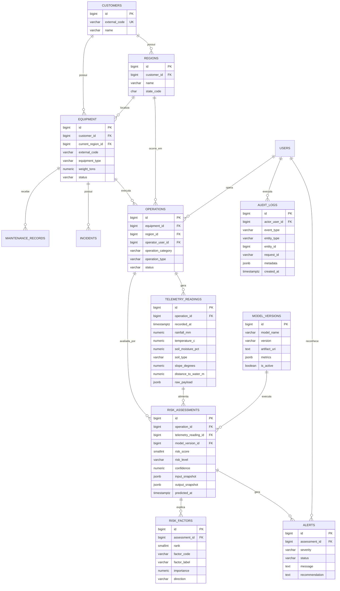

# Modelo de dados SOMPLE — Sprint 3

## Decisão de modelagem

O modelo é relacional porque o SOMPLE precisa consultar e auditar relações claras entre:

**cliente → região → equipamento → operação → telemetria → predição → alerta**.

`JSONB` é usado somente onde a flexibilidade é útil (`raw_payload`, snapshots e metadados), sem transformar o banco inteiro em armazenamento semi-estruturado.
